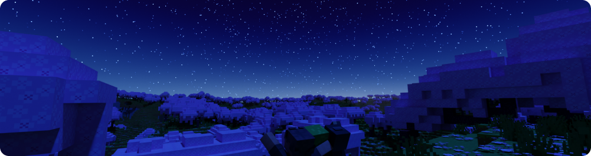

# Правила сервера

Правила поведения на Minecraft сервере.
::: tip **ПОДСКАЗКА**
Методы наказания могут различаться в зависимости от тяжести нарушения и (или) на усмотрение модерации.
:::
::: danger **ВНИМАНИЕ**
В случае бана на Minecraft-сервере, аналогичный бан будет применен на Discord-сервере, и наоборот.
:::

## Игра

1. Запрещено использование утилит, читов, текстур-паков и модов, дающие преимущество перед другими игроками.

::: details **ЗАПРЕЩЁННЫЙ ФУНКЦИОНАЛ**

- Автоматизация действий игрока.
- Обход стандартных ограничений скорости, высоты прыжка, голода и т.д.
- Отсутствие урона от падения.
- XRay и т.п.
- KillAura, CristalAura и любой другой мод дающий сильное преимущество в PvP.
- Автоматическая замена тотема и ломающихся предметов.
- Работающий инвентарь во время ходьбы.
- Freecam/свободный полет как в режиме наблюдателя.
- Моды ускоряющие/упрощающие стройку/ломание блоков.
- Отображение игроков/энтити сквозь блоки.
- Отображение траектории полета стрел, эндер-перлов, снежков и т.п.
- Мини-карта или любой другой способ видеть пространство под землей.
  ::: danger **ВНИМАНИЕ**
  Хранение модов/текстур-паков с функционалом из этого списка – **запрещено**. Оправдание _"Ыыы я же не использую"_ не аргумент.
  :::
  ::: info **ИСКЛЮЧЕНИЕ**
  [Freecam (Fair Play)](https://modrinth.com/mod/legacyfreecam), [Litematica](https://modrinth.com/mod/litematica) с **easyplacemode**
  :::

2. Реклама сторонних Minecraft серверов.

3. Обман/попытка ввести в заблуждение администрацию.

## Коммуникация

1. Будьте взаимоуважительными! Помните, как Вы относитесь к игрокам, так и игроки к Вам. Травля, токсичное поведение, провокация и оскорбление игроков(а также их родных), в том числе по национальным и расовым признакам запрещена.

2. Запрещен бессмысленный или чрезмерный спам и флуд.

3. Запрещено провоцировать на острые темы, обсуждать политическую ситуацию в мире.

4. Запрещено демонстрировать по вебкамере 18+, NSFW, шокирующий или любой другой неприемлемый контент.

5. Намеренная попытка создания шума в голосовом чате для препятствия комуникации.

## Имущество и территория

1. Каждый игрок сервера имеет право на личное пространство и уважение к территории, где он строит или живет.

2. Не разрушайте и не изменяйте чужие постройки без разрешения.

3. Каждый игрок на своей территории может устанавливать свои правила, но правила сервера всегда будут выше.
::: warning **ПРИМЕЧАНИЕ**
Злоупотребление данным правом будет караться.

**Например:** _"Ты зашел на мою территорию, тебе штраф 128 алмазов"_
:::

4. Спавн является центральным поселением сервера и развивается по мере игры. Управление территорией спавна и порядок его развития определяются игроками, занимающимися его развитием.
::: warning **ПРИМЕЧАНИЕ**
Сервер не навязывает единую модель городского управления. Каждое поселение может самостоятельно устанавливать правила организации своей территории, если они не противоречат правилам сервера.
:::
5. Если игрок планирует занять территорию для строительства, рекомендуется заранее обозначить её любым понятным способом (например: табличкой, временной разметкой или началом стройки). В противном случае, необозначенная территория может считаться свободной для других игроков.

6. Территориальные вопросы должны быть обоснованы реальным строительством или активным использованием зоны.

7. Территория и постройки, которые не изменялись более 14 дней с момента создания или последней значимой модификации, могут быть признаны общественной территорией, если они:

- _являются пустыми конструкциями ("коробками" без признаков проживания)_
- _представляют собой разрушенные базы_
- _не попадают под особые правила конкретного города или зоны_
