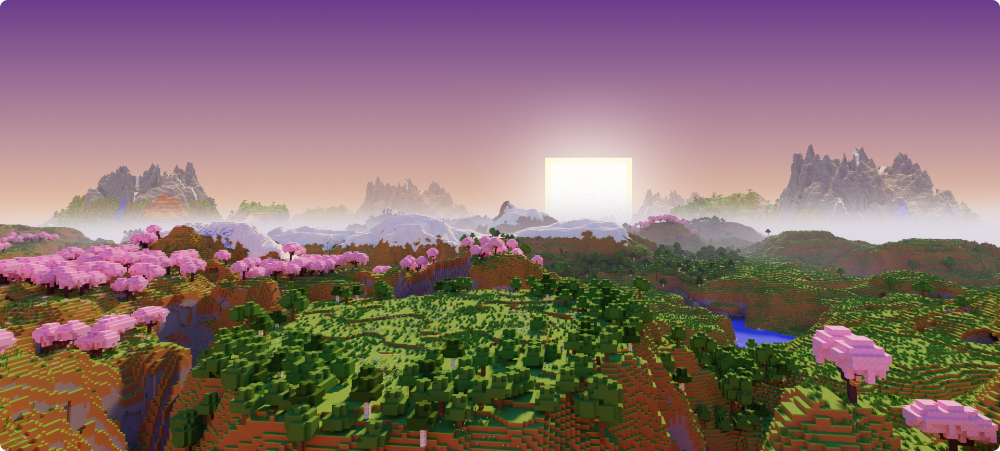
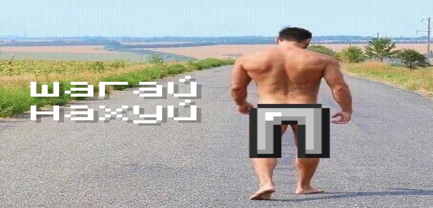

import { Steps } from '@rspress/core/theme';
import { Callout } from '@rspress/core/theme-original';



## Подача заявки

<Steps>

### Этап 1

Сперва нужно быть участником [нашего Discord сервера](https://discord.gg/minecis).

### Этап 2

Далее переходим в канал [#💚・начать](https://discord.com/channels/1202938978370584586/1473712614688293046) и подробно заполняем каждый пункт в заявке.

Вам также могут начать задавать дополнительные вопросы, если информации в заявке было недостаточно.

:::warning ВНИМАНИЕ

Заявку нужно заполнять честно и развернуто. Короткие, "написанные на отъебись" или при помощи ИИ заявки с вероятностью 99% будут отклоняться, имейте ввиду.
:::

### Этап 3

Обычно заявки рассматривают в течении нескольких часов с момента подачи. В зависимости от решения администрации у вас есть 2 пути:

:::details ✅ Заявку ПРИНЯЛИ
Добавляйте адрес сервера `play.minecis.net` в список серверов **Сетевой игры** и подключайтесь, после одобрения заявки ваш аккаунт автоматически получает доступ к серверу. Поздравляю и добро пожаловать 🥳

```bash
play.minecis.net
```

:::

:::details ❌ Заявку ОТКЛОНИЛИ



<Callout type="details" title="❓ А если НЕ ХОЧУ?">
  У вас всё еще есть возможность повторно подать заявку через 24 часа с момента
  отклонения.
</Callout>
:::

</Steps>
