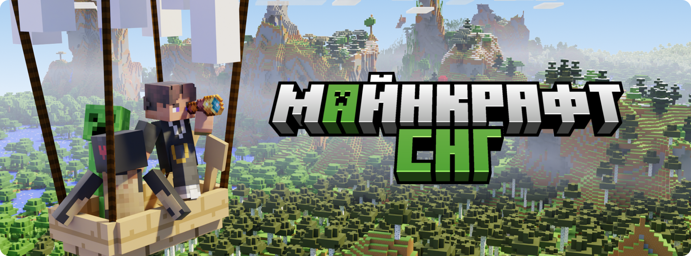

import { Steps } from '@rspress/core/theme';
import { Callout } from '@rspress/core/theme-original';

---

head:

- - meta
  - property: og:title
    content: WIKI MINECRAFT СНГ - Главная
- - meta
  - property: og:description
    content: Основная страница Википедии по серверу MINECRAFT СНГ
- - meta
  - property: og:image
    content: https://cdn.discordapp.com/attachments/1022933772984918026/1526182854130925668/Frame_3157.png?ex=6a56180b&is=6a54c68b&hm=5d6501c4055a09a3c2286d1547f4d45653ca4b3b559f8379f6e834b56f0ebb50&
- - meta
  - property: og:color
    content: #4DB348

---



# Добро пожаловать

MINECRAFT СНГ — народный ванилла+ Minecraft сервер нацеленный на долгосрочную игру.

Сервер работает на версии <span style={{ color: "#00AF5C" }}>**1.21.11 Java Edition**</span>, но вы также можете играть с <span style={{ color: "#00AF5C" }}>**Bedrock Edition**</span>. Чтобы играть с других версий используйте мод [ViaFabricPlus](https://modrinth.com/mod/viafabricplus/versions) или любой другой похожий.

## Подача заявки

Наш сервер ориентирован на создание дружного и комфортного сообщества. Чтобы получить доступ, необходимо заполнить заявку и рассказать о себе. Опишите все, что считаете важным: **чем подробнее вы представите себя, тем легче нам будет принять решение**.

<Steps>

### Этап 1

Сперва нужно быть участником [нашего Discord сервера](https://discord.gg/minecis).

### Этап 2

Далее переходим в канал [#💚・начать](https://discord.com/channels/1202938978370584586/1473712614688293046) и подробно заполняем каждый пункт в заявке.

Вам также могут начать задавать дополнительные вопросы, если информации в заявке было недостаточно.

:::warning ВНИМАНИЕ

Заявку нужно заполнять честно и развернуто. Короткие, "написанные на отъебись" или при помощи ИИ заявки с вероятностью 99% будут отклоняться, имейте ввиду.
:::

### Этап 3

Обычно заявки рассматривают в течении нескольких часов с момента подачи. В зависимости от решения администрации у вас есть 2 пути:

:::details ✅ Заявку ПРИНЯЛИ
Добавляйте адрес сервера `play.minecis.net` в список серверов **Сетевой игры** и подключайтесь, после одобрения заявки ваш аккаунт автоматически получает доступ к серверу. Поздравляю и добро пожаловать 🥳

Если вы подключаетесь с Bedrock Edition, то в поле **Порт** укажите `19132`.

```bash
play.minecis.net
```

:::

:::details ❌ Заявку ОТКЛОНИЛИ


<Callout type="details" title="❓ А если НЕ ХОЧУ?">
  У вас всё еще есть возможность повторно подать заявку через 24 часа с момента
  отклонения.
</Callout>
:::

</Steps>
