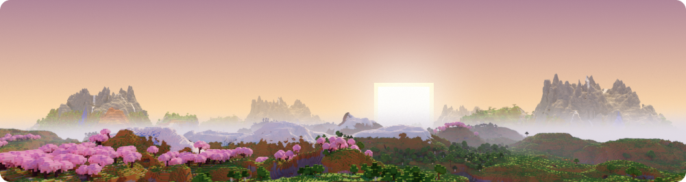
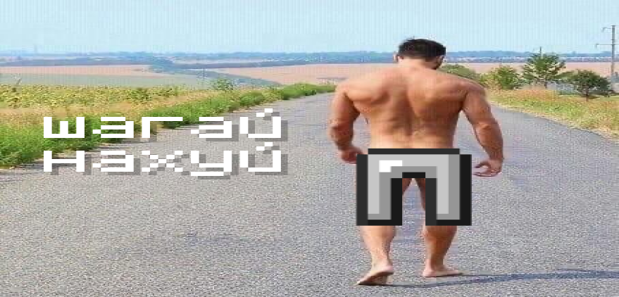
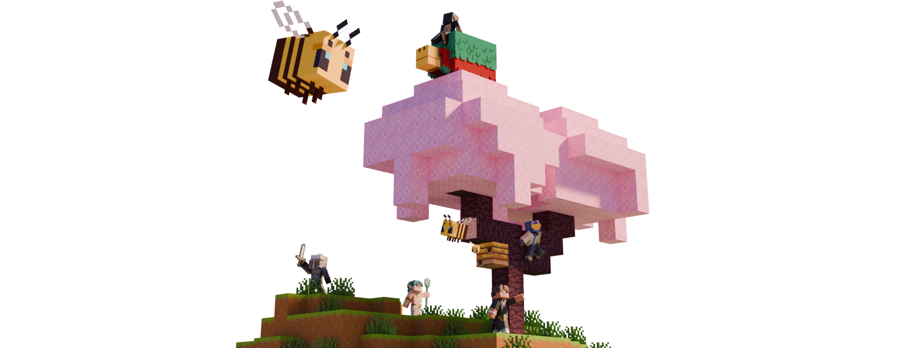

# Добро пожаловать

<span style="color: #8C8C8C">**MINECRAFT СНГ** – народный ванильный Minecraft сервер для всех желающих.</span>

## <span style="color: #646CFF">Начать играть</span>

Для начала нужно быть участником нашего [Discord сервера](https://discord.gg/minecis/).

Далее необходимо перейти в канал [#💚 ┃ начать](https://discord.com/channels/1202938978370584586/1473712614688293046) и заполнить заявку как можно подробнее ответив на все вопросы.
::: tip <span style="color: #646CFF">ПОДСКАЗКА</span>
Если авторизоваться через [наш сайт](https://minecis.net/), то Вас **автоматически** присоединит к Discord серверу.
:::

::: details ✅ Если вашу заявку одобрили
Добавляйте адрес сервера `play.minecis.net` в список серверов Сетевой игры и подключайтесь, после одобрения заявки Ваш аккаунт автоматически получает доступ к серверу. _Поздравляю и добро пожаловать 🥳_

```
play.minecis.net
```

:::

::: details ❌ Если вашу заявку отклонили

::: details А если не хочу?
У Вас всё еще есть возможность повторно подать заявку через **24 часа** с момента отклонения. Вы также можете воспользоваться **Платным входом**.
::: tip <span style="color: #646CFF">ПОДСКАЗКА</span>
Платный вход служит гарантией добросовестной игры. Это также помогает упростить получение доступа к серверу одновременно поддержав проект материально
:::

## <span style="color: #ffb764ff">Подключение</span>

Наш сервер работает на версии <span style="color: #ffb764ff">Minecraft 1.21.11 Java Edition</span>, для подключения используйте адрес `play.minecis.net` .

**Приятной игры!**


