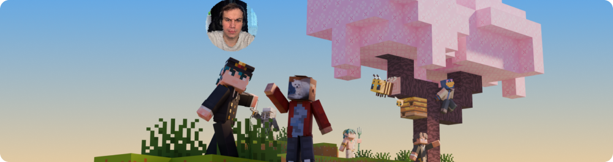
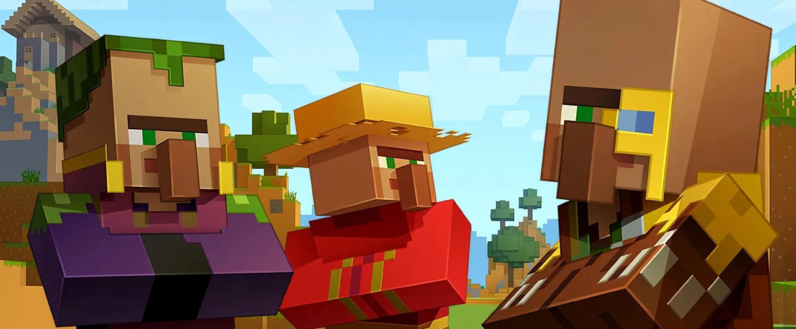
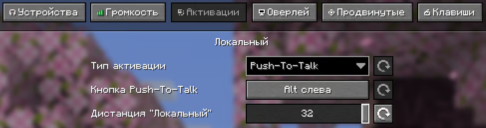
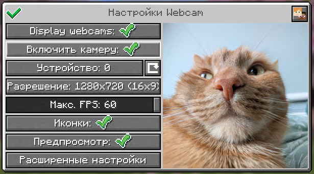
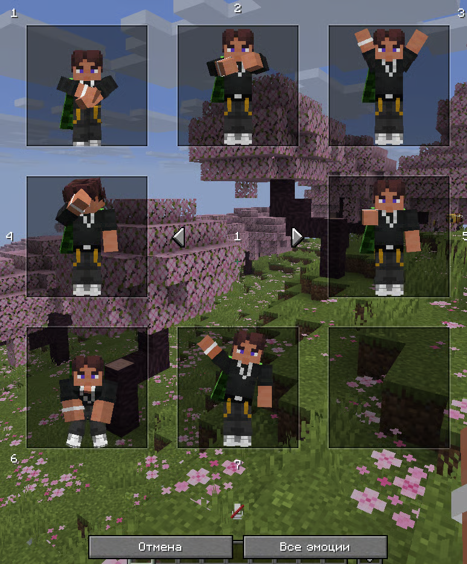

# Механики

Информация о работающих модах и механиках на сервере.
::: tip ПОДСКАЗКА
Играть на сервере можно **без установки каких-либо модов**. Мы поддерживаем их использование для более удобного и интересного взаимодействия между игроками, без какого-либо влияния на игровой процесс.
:::

## Балансировка торговли

На нашем сервере изменены торги жителей и странствующих торговцев для улучшения экономики.

- [Подробнее](https://ru.minecraft.wiki/w/%D0%91%D0%B0%D0%BB%D0%B0%D0%BD%D1%81%D0%B8%D1%80%D0%BE%D0%B2%D0%BA%D0%B0_%D1%82%D0%BE%D1%80%D0%B3%D0%BE%D0%B2%D0%BB%D0%B8)

## Голосовой чат

На нашем сервере для этого используется мод **Plasmo Voice**.

- [Скачать](https://modrinth.com/plugin/plasmo-voice/versions?g=1.21.11&l=fabric&l=forge)

### Настройка и активация

По умолчанию меню настроек мода открывается по клавише <kbd>V</kbd>, а активация микрофона клавишей <kbd>M</kbd>. Для лучшей игры рекомендуем во вкладке **Активации** выставить параметр **Дистанция "Локальный"** на `32` , благодаря чему вы будете дальше слышать игроков.

Остальное настраивайте на свой вкус.

## Вебкамеры

На нашем сервере для этого используется мод **Webcam**.

- [Скачать](https://modrinth.com/plugin/webcam-mod/versions?g=1.21.11&l=fabric)

### Настройка и активация

По умолчанию меню настроек мода открывается по клавише <kbd>C</kbd>. Изначально ваша камера отключена и не будет транслироваться на сервер, для включения нужно сперва убедиться в её работоспособности, после чего включить камеру в Minecraft через меню настроек мода.

## Эмоции

На нашем сервере для этого используется мод **EmoteCraft**.

- [Скачать](https://modrinth.com/plugin/emotecraft/versions?g=1.21.11&l=forge&l=fabric)

### Настройка и активация

По умолчанию меню с активацией и настроек мода открывается по клавише <kbd>B</kbd>. В целом, это всё что нужно знать, но если вдруг Вам необходимо что-то настроить, то открывайте меню, далее **Все эмоции** - **Настройка эмоций** - **Настройка модификаций**.

