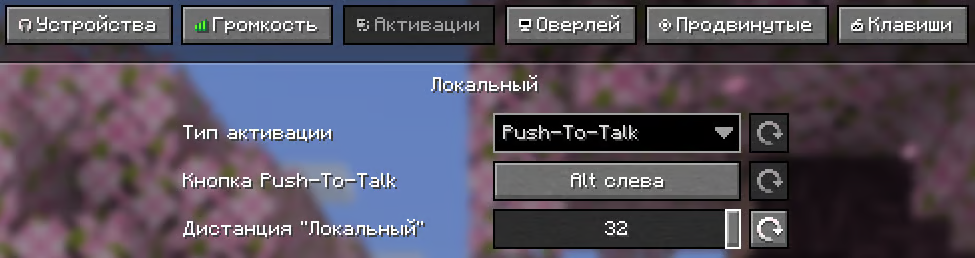
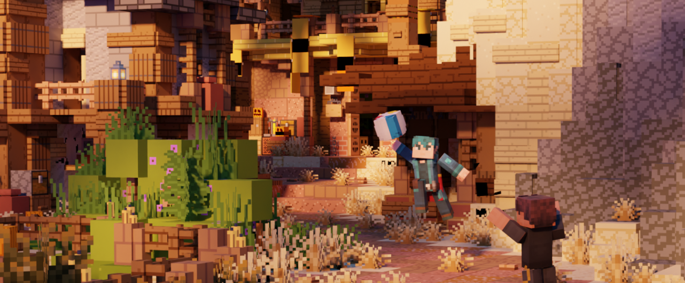

import { PageTabs, PageTab, Tag } from '@rspress/core/theme';

<PageTabs>

<PageTab label="Информация">

## 🎙️ Голосовой чат

На нашем сервере для этого используется мод <span style={{ color: "#33b4ffff" }}>**Plasmo Voice**</span>.

- [Скачать](https://modrinth.com/plugin/plasmo-voice/versions?g=1.21.11&l=fabric&l=forge)

### Настройка и активация

По умолчанию меню настроек мода открывается по клавише `V`, а активация микрофона клавишей `M`. Для лучшей игры рекомендуем во вкладке **Активации** выставить параметр **Дистанция "Локальный"** на `32` , благодаря чему вы будете дальше слышать игроков.

Если по какой-либо причине у вас перестал работать голосовой чат, попробуйте переподключиться, выполнив команду `/vrc`. Если это не помогло, обратитесь в [нашу поддержку через Discord](https://discord.com/channels/1202938978370584586/1235583949707673663).



### Дополнение "Кастомные пластинки"

На сервере вы можете загружать собственные песни на пластинки. Для этого найдите нужное видео на [YouTube](https://www.youtube.com/) и скопируйте ссылку на него. Затем введите в игре команду:

```
/disc burn <ССЫЛКА> <НАЗВАНИЕ (необязательно)>
```

## 🏐 Волейбольные мячи

На нашем сервере реализованы полноценные волейбольные мячи, которые можно бросать с разной силой и даже отбивать.

Чтобы создать волейбольный мяч нужно найти **иглобрюха** и держа в руке **8 ед. кожи** нажать на него, после чего он станет мячом.

Для броска нужно нажать `ЛКМ`, а чтобы подорбать нужно рядом с мячом нажать `Shift`. Сила броска регулируется зажатой клавишей `Shift`.

Изменить скин мяча можно командой `/ballskin` держа его в руке.



</PageTab>

<PageTab label="Как это работает?">

## Test1

</PageTab>

</PageTabs>
