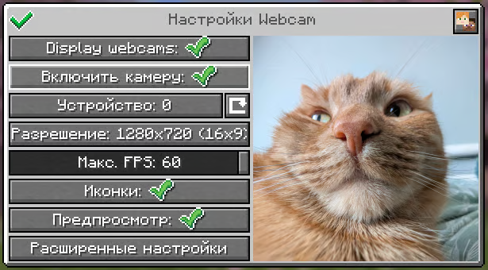
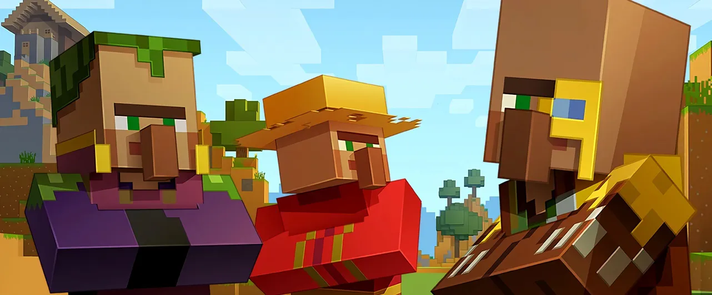
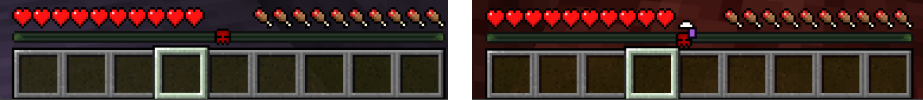
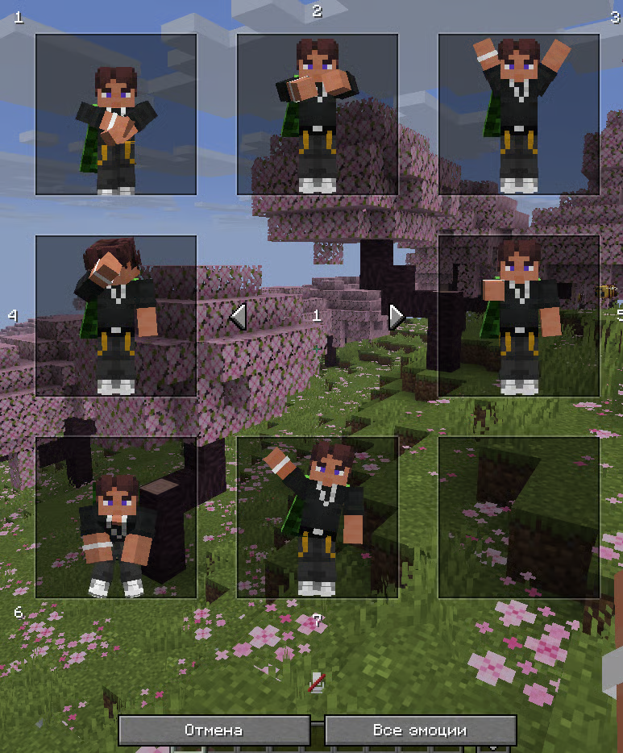
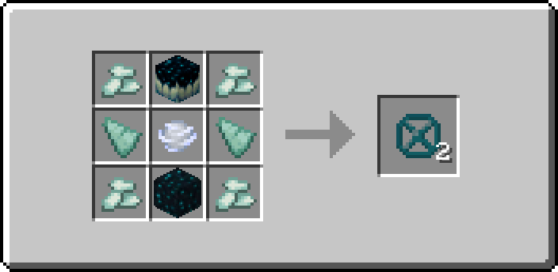
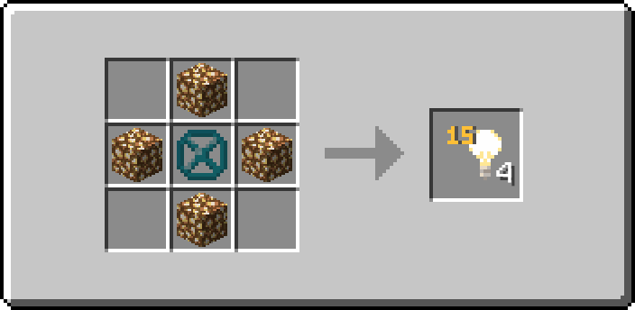
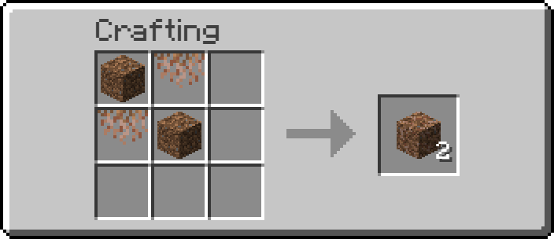
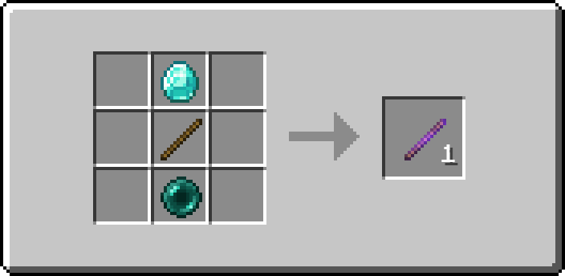

:::note ПОДСКАЗКА
Играть на сервере **можно без установки каких-либо модов**. Мы поддерживаем их использование для более удобного и интересного взаимодействия между игроками, без какого-либо влияния на игровой процесс.

Все моды мы собрали в одну коллекцию и опубликовали на **Modrinth**, чтобы вам проще было найти их: [ССЫЛКА](https://modrinth.com/collection/C5RB6gEe)
:::

## <span style={{ color: "#33b4ffff" }}>Голосовой чат</span>

На нашем сервере для этого используется мод <span style={{ color: "#33b4ffff" }}>**Plasmo Voice**</span>.

- [Скачать](https://modrinth.com/plugin/plasmo-voice/versions?g=26.2&l=fabric&l=forge)

### Настройка и активация

По умолчанию меню настроек мода открывается по клавише `V`, а активация микрофона клавишей `M`. Для лучшей игры рекомендуем во вкладке **Активации** выставить параметр **Дистанция "Локальный"** на `32` , благодаря чему вы будете дальше слышать игроков.

Если по какой-либо причине у вас перестал работать голосовой чат, попробуйте переподключиться, выполнив команду `/vrc`. Если это не помогло, обратитесь в [нашу поддержку через Discord](https://discord.com/channels/1202938978370584586/1235583949707673663).


### Дополнение "Кастомные пластинки"

На сервере вы можете загружать собственные песни на пластинки. Для этого найдите нужное видео на [YouTube](https://www.youtube.com/) и скопируйте ссылку на него. Затем введите в игре команду:

```
/disc burn <ССЫЛКА> <НАЗВАНИЕ (необязательно)>
```

---

## <span style={{ color: "#33ffccff" }}>Вебкамеры</span>

На нашем сервере для этого используется мод <span style={{ color: "#33ffccff" }}>**Webcam**</span>.

- [Скачать](https://modrinth.com/plugin/webcam-mod/versions?g=26.2&l=fabric)

### Настройка и активация

По умолчанию меню настроек мода открывается по клавише `C`. Изначально ваша камера отключена и не будет транслироваться на сервер, для включения нужно сперва убедиться в её работоспособности, после чего включить камеру в Minecraft через меню настроек мода



---

## <span style={{ color: "#c533ffff" }}>Балансировка торговли</span>

На нашем сервере изменены торги жителей и странствующих торговцев для улучшения экономики.

- [Подробнее](https://ru.minecraft.wiki/w/%D0%91%D0%B0%D0%BB%D0%B0%D0%BD%D1%81%D0%B8%D1%80%D0%BE%D0%B2%D0%BA%D0%B0_%D1%82%D0%BE%D1%80%D0%B3%D0%BE%D0%B2%D0%BB%D0%B8)



---

## <span style={{ color: "#ff002bff" }}>Метки смерти</span>

После смерти, игрок получит уведомление в чате с координатами места смерти и на локатор-баре начнет отображаться **метка-череп** (до 5 меток одновременно).

Последняя точка смерти будет иметь <span style={{ color: "#ff002bff" }}>красную</span> метку, а все предыдущие будут <span style={{ color: "#afafafff" }}>серыми</span>.

При этом метки автоматически синхронизируются между Верхним миром и Незером с учетом пересчета координат. То есть, если вы умрете в одном измерении, а возродитесь в другом, плагин создаст особую метку смерти (череп с порталом), которая укажет место, где нужно построить портал, чтобы попасть как можно ближе к месту смерти.

Чтобы очистить локатор-бар от меток используйте команду `/markers clear`



---

## <span style={{ color: "#30AEE5" }}>Режим инспектора</span>

Режим инспектора позволяет просматривать историю изменений любых блоков и контейнеров, включая сундуки, печи, бочки, воронки и другие хранилища.

Для включения режима используйте команду `/co inspect` (или `/co i`). После этого нажимайте `ЛКМ` или `ПКМ` по блоку, чтобы посмотреть историю взаимодействий с ним: кто устанавливал или ломал блок, открывал контейнер, изменял его содержимое и когда это произошло.

Чтобы выйти из режима инспектора, повторно выполните команду `/co inspect` (или `/co i`).

При необходимости можно быстро посмотреть недавние изменения вокруг себя используя команду `/co near`. Она выводит историю действий игроков в радиусе 5 блоков от вашего текущего местоположения без необходимости выбирать конкретный блок.

---

## <span style={{ color: "#ffd900ff" }}>Эмоции</span>

На нашем сервере для этого используется мод <span style={{ color: "#ffd900ff" }}>**EmoteCraft**</span>.

- [Скачать](https://modrinth.com/plugin/emotecraft/versions?g=26.2&l=forge&l=fabric)

### Настройка и активация

По умолчанию меню с активацией и настроек мода открывается по клавише `B`.

В целом, это всё что нужно знать, но если вдруг Вам необходимо что-то настроить, то открывайте меню, далее **Все эмоции** - **Настройка эмоций** - **Настройка модификаций**.



---

## <span style={{ color: "#00ffb3ff" }}>Декоративные блоки</span>

У нас на сервере можно создать блоки для строительства, недоступные в обычном выживании.

### Блок пустоты

После установки данный блок нельзя добыть, чтобы его убрать нужно на его место поставить любой другой блок.



### Блок света

После установки данный блок нельзя добыть, чтобы его убрать нужно на его место поставить любой другой блок.

Чтобы уменьшить силу света используйте `Shift + ЛКМ`, а чтобы увеличить `Shift + ПКМ`(_только по воздуху_).



### Корнистая земля

В отличие от каменистой земли, корнистая земля в ванильном Minecraft вообще не имеет рецепта крафта. Поскольку этот блок востребован в строительстве, мы добавили собственный рецепт.



---

## <span style={{ color: "#b779ffff" }}>Палочка отладки</span>

На нашем сервере вы можете создать **палочку отладки**, которая будет поворачивать блоки и менять их состояние при помощи `ЛКМ` и `ПКМ`.


